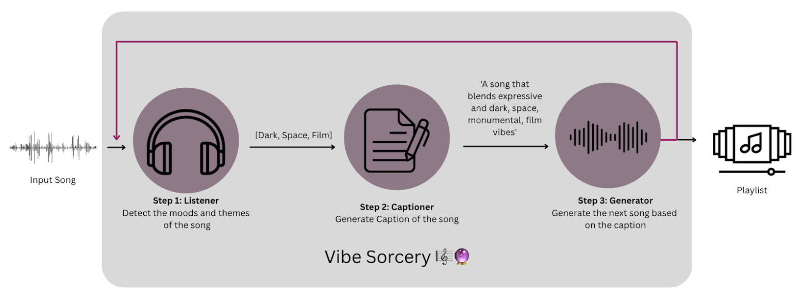

# Vibe Sorcery 🎼🔮  
**Summoning the perfect song for your mood, every time.**

*Vibe Sorcerer* is a mood-based playlist generator designed to create emotionally cohesive listening experiences. Rather than compiling a random selection of tracks, it curates playlists that feel intentional and immersive—each song smoothly transitioning into the next to maintain a consistent emotional arc. The core hypothesis is that a great playlist mirrors an emotional journey, and cohesion can be achieved by ensuring continuity in the emotional states evoked by each track.

The system generates playlists iteratively. Starting with a single input song, it identifies its emotional qualities using [MTG Listening Models](https://github.com/MTG/essentia). It then generates a descriptive caption reflecting the song’s mood using a grammar-based system. This caption serves as input for Riffusion, a music generation model, which creates the next song in the sequence. This process repeats until the desired playlist length is reached, ensuring each transition is emotionally logical and musically fluid.

The motivation behind Vibe Sorcerer stems from a lifelong passion for music. Listening has always been a way for me to clear my mind, process emotions, and stay present. I believe music is one of the most powerful tools for emotional awareness and expression. This project is a personal exploration of how technology can amplify the emotional power of music—and how generative systems can be used not just to create sound, but to shape feeling. In the future, this idea of playlist generation could support therapeutic practices by guiding listeners through carefully curated emotional states. Moreover, using generated songs helps ensure that the emotional response they evoke is not influenced by cultural or contextual associations tied to commercial music, allowing for a clearer and more controlled induction of specific emotional states.


## Getting Started with *Vibe Sorcery*

### 1. Clone the repository
Begin by cloning the repository to your local machine:
```
git clone https://github.com/IsitaRex/Vibe-Sorcery.git
```
### 2. Install Dependencies
Navigate to the project directory and install the required dependencies:
```
pip install -r requirements.txt
```

### 3. Download Pre-trained Models
Download the necessary pre-trained models and save them in a folder named `Models`. Use the following commands:

 ```bash
mkdir -p Models && cd Models
 ```
Download the pre-trained models and save them inside a folder called 
  ```bash
wget https://essentia.upf.edu/models/music-style-classification/discogs-effnet/discogs-effnet-bs64-1.pb
wget https://essentia.upf.edu/models/classification-heads/mtg_jamendo_moodtheme/mtg_jamendo_moodtheme-discogs-effnet-1.pb
wget https://essentia.upf.edu/models/classification-heads/deam/deam-audioset-vggish-2.pb
wget https://essentia.upf.edu/models/feature-extractors/vggish/audioset-vggish-3.pb
 ```

Once the setup is complete, you're ready to generate mood-based playlists with Vibe Sorcery! 🎼🔮

### 4. Create your Playlist

Create a folder called `playlist` (or any name you prefer) and upload a .wav song named `playlist_song_0.wav.` To generate a playlist containing 6 songs, each 47 seconds long, execute:

  ```bash
  python main.py -o playlist -n 6 -d 47.0
   ```

Voilà! Your mood-synchronized playlist is ready to be enjoyed. Prepare yourself for a musical journey where each song flows as if your own heart were the DJ. 🎵✨

## How does the magic in Vibe Sorcery work?  🪄


Vibe Sorcery is implemented through a set of Python classes, each managing a specific step in the playlist generation process:
1. Choose a song
2. `class Listener`: Detect the song’s moods using MTG Listening Models
3. `class Captioner`: Generate a caption describing the song based on its moods
4. `class Generator`: Create a new song based on the caption
5. `class VibeSorcery`: Repeat the process to complete the playlist

### Listener 🎧
The Listener takes a `.wav` file as input, extracts audio embeddings, and uses a multi-label classifier to predict moods. Moods with activations above a threshold (`0.06`) are selected. If none meet the threshold, the top four moods are chosen. The output is a Python list of detected moods.

### Captioner ✍🏻
The Captioner takes the mood list and generates a descriptive caption using grammar templates and synonym dictionaries. Templates were pre-generated with ChatGPT to ensure structured outputs. For each mood, synonyms are randomly selected to add variety. Two disjoint mood subsets (primary and secondary) are incorporated into templates like:
```
"A {primary_moods} song with hints of {secondary_moods} undertones."
```
Using grammars instead of LLMs ensures consistency and control over the style of the generated text.

### Generator 🎶
 The generated caption is used as a prompt to Stable Audio Open 1.0 to synthesize a new 47-second track, ensuring mood coherence across the playlist.

### Vibe Sorcery (Pipeline)
 This class integrates all the 3 previous classes in an iterative process. The user creates a folder named after the playlist and adds an input song (playlist_song_0.wav). Then, simply instantiate and call:
  ```bash
  vibe_sorcery = VibeSorcery(output_dir='playlist')
  playlist_dict = vibe_sorcery.generate_playlist(input_song_path='playlist/playlist_song_0.wav', num_songs=6, duration=47.0)
  ```

## Generative Models

The first stage of playlist generation involves analyzing an input song to detect its moods. To achieve this, the system first extracts audio embeddings from the song, which are then fed into a multi-label classification model.

### Discogs-EffNet Model: [discogs-effnet-bs64](https://essentia.upf.edu/models.html#discogs-effnet)
 We use audio embedding models based on the EfficientNet architecture, trained on a dataset annotated with Discogs metadata. The model was optimized with a multi-label classification objective targeting 400 Discogs style labels. It takes raw audio signals as input and produces fixed-size embeddings that capture stylistic and mood-related features.

### [MTG-Jamendo Mood and Theme Classifier](https://essentia.upf.edu/models.html#mtg-jamendo-mood-and-theme)
 To model emotional content, we apply a multi-label classifier trained on the mood and theme subset of the MTG-Jamendo dataset, covering 56 classes. This classifier takes the embeddings generated by the Discogs-EffNet model as input and outputs mood and theme labels. The resulting mood annotations support emotion-based music retrieval and playlist generation.
Once the moods are detected, the system generates a textual caption for the song using grammar-based templates. This caption serves as a prompt for the next stage: music generation.

### [Stable Audio Open 1.0](https://huggingface.co/stabilityai/stable-audio-open-1.0)
For audio generation, we employ Stable Audio Open 1.0, which creates up to 47-second stereo samples at 44.1kHz from text prompts. The model architecture includes an audio autoencoder (to compress waveforms into a latent space), a T5-based text encoder (to embed the prompts), and a transformer-based diffusion model (DiT) that operates within the latent space. Trained on large-scale audio-text pairs, Stable Audio produces high-fidelity, prompt-coherent music suitable for creative playlist expansion.
