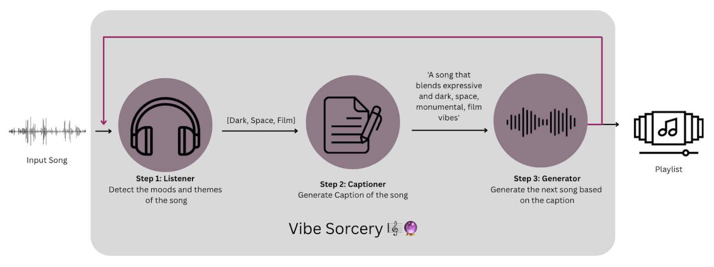
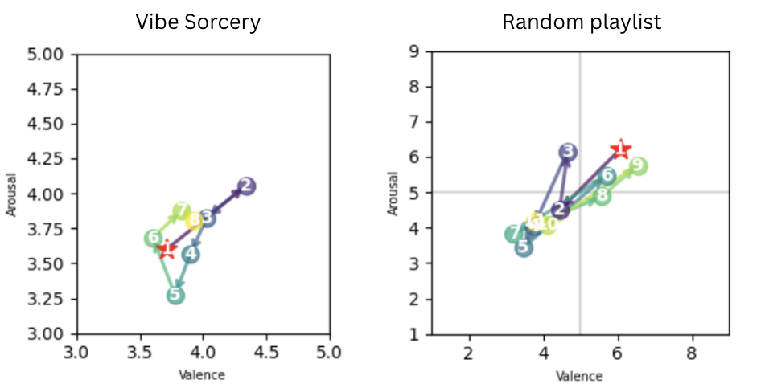

# Vibe Sorcery 🎼🔮  
**Summoning the perfect song for your mood, every time.**

*Vibe Sorcery* is a mood-based playlist generator that leverages generative music to create emotionally cohesive listening experiences. Conventional playlist generator systems treat songs as clusters, selecting the next track based on shared patterns of the entire set such as the same artist, similar tempos or harmonic structures. This static perspective assumes that all songs in the playlist should feel similar to one another, prioritizing uniformity over progression. In contrast, we propose a system based on an alternative perspective: modeling playlist generation as a Markov process, where each subsequent song depends only on the preceding one. In our system, both the genre and the mood of the current track shape the selection of the next song, with mood progression taking precedence and relying solely on the immediately preceding track rather than the entire playlist history.

The core hypothesis is that an effective playlist mirrors an emotional journey, where coherence arises not from static similarity but from dynamic progression. While each transition between songs is determined locally, the overall sequence can still trace a path through widely different emotional states. These changes occur gradually, allowing the playlist to move, for instance, from somber and subdued moods to uplifting and energetic ones.

The motivation behind Vibe Sorcerer stems from a lifelong passion for music. Listening has always been a way for me to clear my mind, process emotions, and stay present. I believe music is one of the most powerful tools for emotional awareness and expression. This project is a personal exploration of how technology can amplify the emotional power of music—and how generative systems can be used not just to create sound, but to shape feeling. In the future, this idea of playlist generation could support therapeutic practices by guiding listeners through carefully curated emotional states. Moreover, using generated songs helps ensure that the emotional response they evoke is not influenced by cultural or contextual associations tied to commercial music, allowing for a clearer and more controlled induction of specific emotional states.

An interactive guide through VibeSorcery can be found in Google Colab: [](https://colab.research.google.com/drive/1g8kJLwaHhzZRGM3NB0vGY29_AbdAK5_x?usp=sharing)

## Getting Started with *Vibe Sorcery*

### 1. Clone the repository
Begin by cloning the repository to your local machine:
```
git clone https://github.com/IsitaRex/Vibe-Sorcery.git
```
### 2. Install Dependencies
Navigate to the project directory and install the required dependencies:
```
pip install -r requirements.txt
```

### 3. Download Pre-trained Models
Download the necessary pre-trained models and save them in a folder named `Models`. Use the following commands:

 ```bash
mkdir -p Models && cd Models
 ```
Download the pre-trained models and save them inside a folder called 
  ```bash
# !wget https://essentia.upf.edu/models/music-style-classification/discogs-effnet/discogs-effnet-bs64-1.pb
# !wget https://essentia.upf.edu/models/classification-heads/mtg_jamendo_moodtheme/mtg_jamendo_moodtheme-discogs-effnet-1.pb
# !wget https://essentia.upf.edu/models/classification-heads/mtg_jamendo_genre/mtg_jamendo_genre-discogs-effnet-1.pb
# !wget https://essentia.upf.edu/models/classification-heads/deam/deam-audioset-vggish-2.pb
# !wget https://essentia.upf.edu/models/feature-extractors/vggish/audioset-vggish-3.pb
# !wget https://essentia.upf.edu/models/feature-extractors/musicnn/msd-musicnn-1.pb
# !wget https://essentia.upf.edu/models/classification-heads/deam/deam-audioset-musinn-2.pb

 ```

### 4. Create your Playlist

Create a folder called `playlist` (or any name you prefer) and upload a .wav song named `playlist_song_0.wav.` To generate a playlist containing 6 songs, each 47 seconds long, execute:

  ```bash
  python main.py -o playlist -n 6 -d 47.0
   ```

## How does the magic in Vibe Sorcery work?  🪄


Vibe Sorcery is implemented through a set of Python classes, each managing a specific step in the playlist generation process:
1. Choose a song
2. `class Listener`: Detect the song’s moods using MTG Listening Models
3. `class Captioner`: Generate a caption describing the song based on its moods
4. `class Generator`: Create a new song based on the caption
5. `class VibeSorcery`: Repeat the process to complete the playlist

### Listener 🎧
The Listener takes a `.wav` file as input, extracts audio embeddings, and uses a multi-label classifier to predict moods. Moods with activations above a threshold (`0.06`) are selected. If none meet the threshold, the top four moods are chosen. The output is a Python list of detected moods.

### Captioner ✍🏻
The Captioner takes the mood list and generates a descriptive caption using grammar templates and synonym dictionaries. Templates were pre-generated with ChatGPT to ensure structured outputs. For each mood, synonyms are randomly selected to add variety. Two disjoint mood subsets (primary and secondary) are incorporated into templates like:
```
"A {primary_moods} song with hints of {secondary_moods} undertones."
```
Using grammars instead of LLMs ensures consistency and control over the style of the generated text.

### Generator 🎶
 The generated caption is used as a prompt to Stable Audio Open 1.0 to synthesize a new 47-second track, ensuring mood coherence across the playlist.

### Vibe Sorcery (Pipeline)
 This class integrates all the 3 previous classes in an iterative process. The user creates a folder named after the playlist and adds an input song (playlist_song_0.wav). Then, simply instantiate and call:
  ```bash
  vibe_sorcery = VibeSorcery(output_dir='playlist')
  playlist_dict = vibe_sorcery.generate_playlist(input_song_path='playlist/playlist_song_0.wav', num_songs=6, duration=47.0)
  ```

## Generative Models

The first stage of playlist generation involves analyzing an input song to detect its moods. To achieve this, the system first extracts audio embeddings from the song, which are then fed into a multi-label classification model.

### Discogs-EffNet Model: [discogs-effnet-bs64](https://essentia.upf.edu/models.html#discogs-effnet)
 We use audio embedding models based on the EfficientNet architecture, trained on a dataset annotated with Discogs metadata. The model was optimized with a multi-label classification objective targeting 400 Discogs style labels. It takes raw audio signals as input and produces fixed-size embeddings that capture stylistic and mood-related features.

### [MTG-Jamendo Mood and Theme Classifier](https://essentia.upf.edu/models.html#mtg-jamendo-mood-and-theme)
 To model emotional content, we apply a multi-label classifier trained on the mood and theme subset of the MTG-Jamendo dataset, covering 56 classes. This classifier takes the embeddings generated by the Discogs-EffNet model as input and outputs mood and theme labels. The resulting mood annotations support emotion-based music retrieval and playlist generation.
Once the moods are detected, the system generates a textual caption for the song using grammar-based templates. This caption serves as a prompt for the next stage: music generation.

### [Stable Audio Open 1.0](https://huggingface.co/stabilityai/stable-audio-open-1.0)
For audio generation, Stable Audio Open 1.0 is used, which creates up to 47-second stereo samples at 44.1kHz from text prompts. The model architecture includes an audio autoencoder (to compress waveforms into a latent space), a T5-based text encoder (to embed the prompts), and a transformer-based diffusion model (DiT) that operates within the latent space. Trained on audio-text pairs, consisting of 486492 audio recordings, where 472618 are from Freesound and 13874 are from the Free Music Archive (FMA). This data was used to train our autoencoder and DiT and used a publicly available pre-trained T5 model.

### [MusiCNN pre-trained on DEAM dataset](https://essentia.upf.edu/models.html#arousal-valence-deam)
Playlists are evaluated by mapping songs in the arousal-valence plane. Coordinates are derived using MTG listening models, specifically a MusiCNN model pre-trained on the DEAM dataset, which outputs arousal and valence values in the range [1, 9].

# Example Outputs 💿

| Input Song                  | Link to Playlist               |
|-----------------------------|--------------------------------|
| Breathing - Ben Böhmer      | [Playlist Breathing 🚀](https://drive.google.com/drive/folders/1RwQ_kiHausN167qqiOSivtobZJ2el9fx?usp=sharing)           |
| Little Monster - Royal Blood| [Playlist Little Monster 👾](https://drive.google.com/drive/folders/18CBIvSUZiUtitfc4HXYHvRU1G9-QMUY1?usp=sharing)      |
| Psychosocial - Slipknot     | [Playlist Psychosocial 👽](https://drive.google.com/drive/folders/1QucwrYmalB8VHqLnpkzl1nIbloJtWeCl?usp=sharing)        |
| Eclipse - João Gilberto     | [Playlist Eclipse 🌑](https://drive.google.com/drive/folders/1-CEAv7NSxBwkxxOHFPXTQXkshSoi3ch2?usp=sharing)             |
| Colombia Tierra Querida     | [Playlist Colombia Tierra Querida 🌑](https://drive.google.com/drive/folders/1jAB3JIaqEyCoTWsiGVmiNMPM8Q2A1sKJ?usp=sharing) |

# Evaluation 
To analyze and visualize songs from an emotional perspective, the Arousal-Valence plane is employed, a two-dimensional model where valence (ranging from negative to positive) represents the pleasantness of a musical experience, while arousal (ranging from calm to excited) captures the intensity of the emotion evoked. This framework enables songs to be mapped within an emotional coordinate system.
MTG’s listening models are used to predict arousal and valence values for each song. By plotting these values, songs can be visualized within this emotional latent space, and the trajectories created by Vib Sorcery’s playlist generation can be examined. This method provides both quantitative and qualitative insights into the emotional flow of the generated playlists. 

For example:


The evaluation compares a Vibe Sorcery-generated playlist with a randomly generated playlist. The random playlist exhibits abrupt transitions (e.g., from low to high arousal/valence) with an average distance of 2.09 and a maximum of 3.03 in the AV space. In contrast, Vibe Sorcery produces smoother transitions, achieving significantly lower average (0.37) and maximum (0.77) distances. This demonstrates the system’s ability to maintain emotional coherence through mood-driven captioning. 

